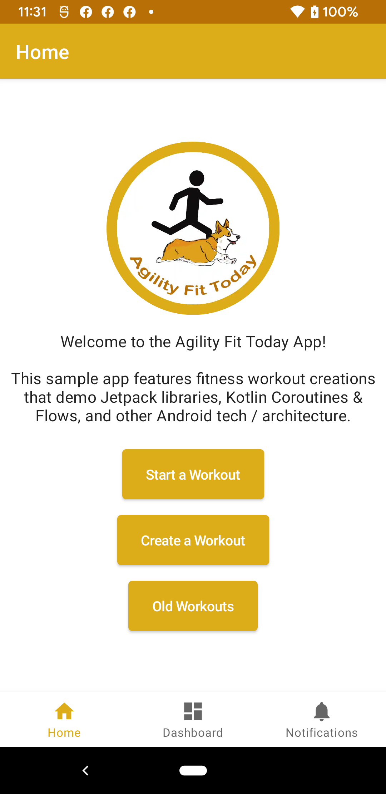

# AgilityFitTodayApp
Android/iOS Apps created to practice with different iOS/Android Tech. 
These apps were built to have similar feature sets using native Android/iOS.

## Proposed Features

- Create a workout
	- Add 1+ workout items
	- Change workout item quantity / time
	- Change order of items
	- Remove items
	- Save workout
	- Workout will guestimate time on each total workout
- Random workout generator
- Workout generator based on topic
- Workout item details
	- What is the item / how to do that exercise
	- w/ animations
- Calendar of workouts
	- shareable to iCal / Google calendar
- Badges for number of successful workouts
	- Badges page
	- Badges with animations
- Dog workout for agility flavor

## Android

    

## iOS

Screenshots TBD

## Disclaimers

TBD
