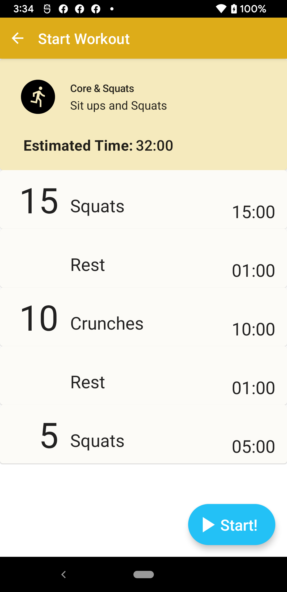
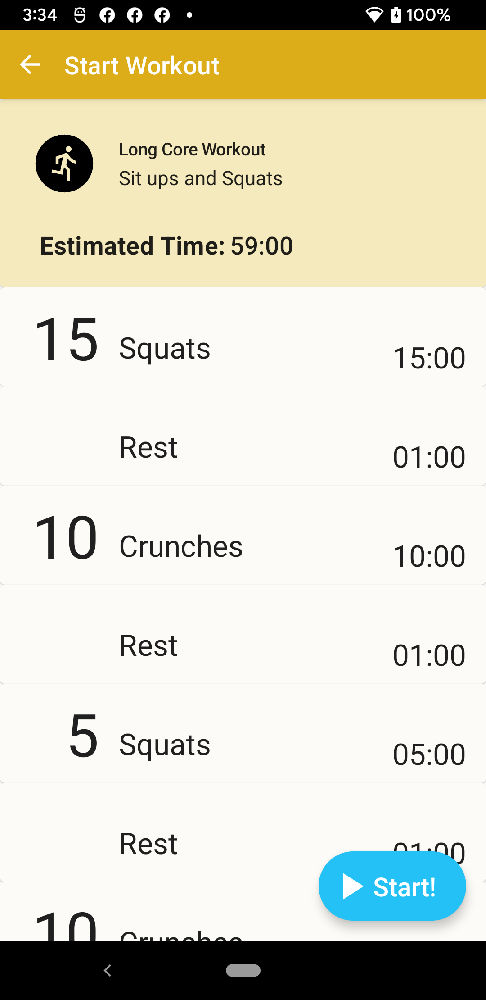

# Android AgilityFitTodayApp
Sample App created to practice with different Android Tech

      

## Proposed Features

- Start a workout (WIP)
- Create a workout
        - Add 1+ workout items
        - Change workout item quantity / time
        - Change order of items
        - Remove items
        - Save workout
        - Workout will guestimate time on each total workout
- Random workout generator
- Workout generator based on topic
- Workout item details
        - What is the item / how to do that exercise
        - w/ animations
- Calendar of workouts
        - shareable to iCal / Google calendar
- Badges for number of successful workouts
        - Badges page
        - Badges with animations
- Dog workout for agility flavor

## Android Tech
* Kotlin
* MVVM
* Jetpack ViewModel
* Room
* Coroutines
* Kotlin Flow
* Jetpack Compose
* Hilt 
* Jetpack Pages

## TODO (Tech)
* MotionLayout intro animation
* WorkManager
* MaterialTheme3 with custom palette
* MaterialU with Jetpack Compose
* Jetpack Compose Custom UI
* BoxWithConstraints Jetpack Compose
* Jetpack Compose animations
* Kotlin Multiplatform for Networking calls?
* Room 2.4 with relational / mapping queries
* Performance check for recomposition issues
* App Widgets

## TODO (Features)
* Proposed features
* Onboarding
* Dark Mode
* Accessibility
* Remote logging solution + stream logs to web server local
* App widgets

## Disclaimers
TBD
