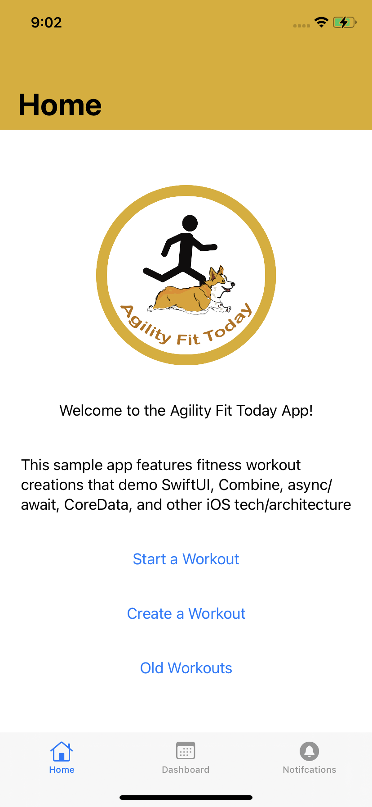
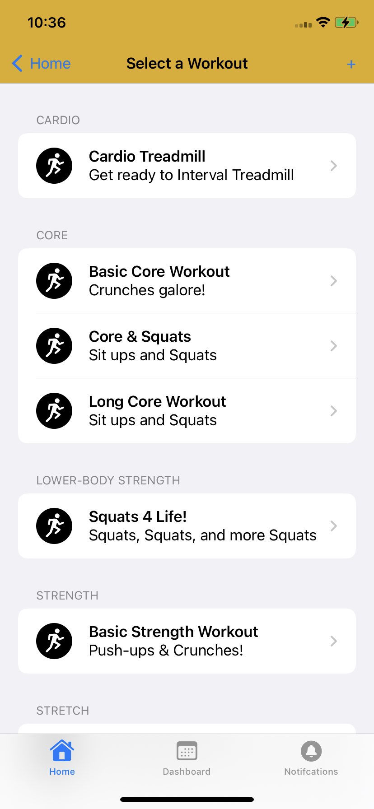
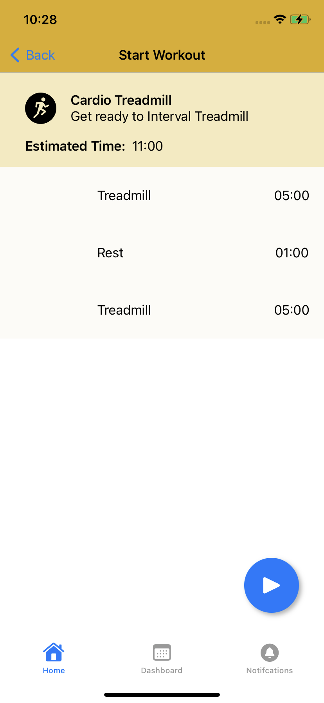
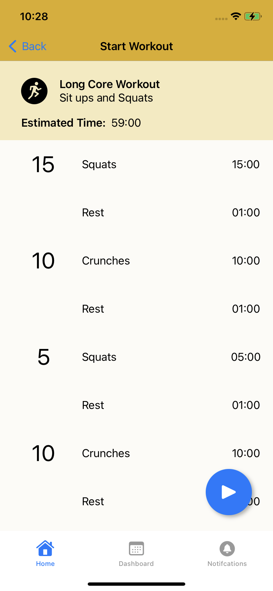
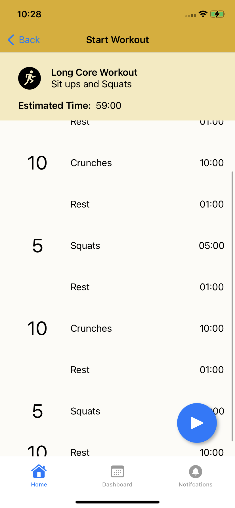

# iOS AgilityFitTodayApp
Sample App created to practice with different iOS Tech

    

## iOS Tech
* SwiftUI
* Combine
* Async/Await
* SPM (Swift Package Manager)

## Completed Features
* App icon
* Add home screen UI 
* Add initial bottom tabs
* Added initial models

## TODO
* Add home screen navigation to select workout view (DONE)
* Select a workout screen (DONE)
* Execute a workout screen (WIP)
* Create a workout screen
* Proposed Features
* Dark Mode
* Accessibility
* CoreData
* Async/Await
* AFNetworking
* TCA (The Composable Architecture) https://github.com/pointfreeco/swift-composable-architecture
        * https://www.pointfree.co/collections/composable-architecture
* SPM (Swift Package Manager)

## Disclaimers
TBD
